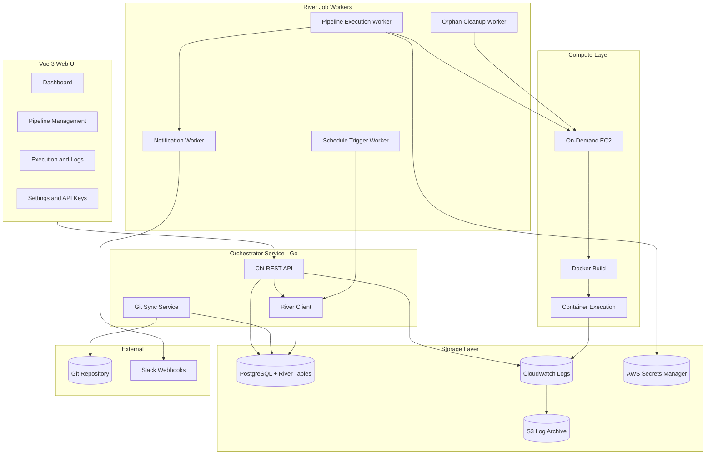
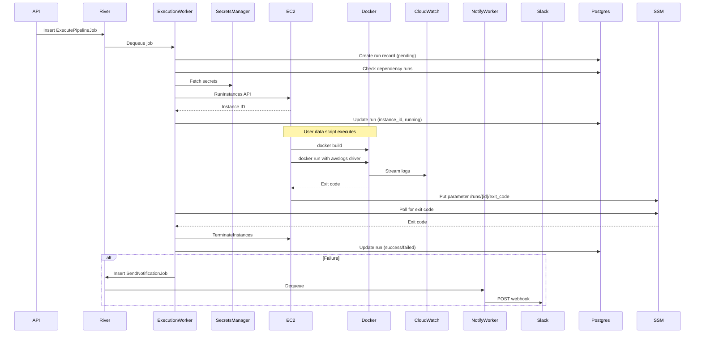

# Container Pipeline Orchestrator - Detailed Architecture

## Overview

A minimal, tool-agnostic pipeline orchestrator. Developers define pipelines as YAML + Dockerfile in a Git repo. The orchestrator syncs definitions, schedules runs, spins up on-demand EC2 instances, builds and executes containers, streams logs, and provides a management UI.**Key design principles:**

- Tool-agnostic: Containers can run anything (Python, DuckDB, shell scripts, binaries)
- Exit code = status: Universal success/failure detection (exit 0 = success)
- Git-native: Pipeline definitions live in version control
- Minimal overhead: No agents in containers, no SDK required
- Durable execution: River job queue ensures jobs survive orchestrator restarts
- Temporal-ready: Orchestration logic structured for future Temporal migration

---

## Implementation Roadmap

### Phase Overview

```mermaid
gantt
    title Implementation Phases
    dateFormat X
    axisFormat %s
    
    section Foundation
    Phase 1 - Project Setup       :p1, 0, 1
    Phase 2 - Domain Models       :p2, after p1, 1
    
    section Backend Core
    Phase 3 - HTTP API            :p3, after p2, 1
    Phase 4 - Git Integration     :p4, after p2, 1
    Phase 5 - AWS Integration     :p5, after p2, 1
    
    section Execution
    Phase 6 - Execution Engine    :p6, after p5, 1
    Phase 7 - Scheduling          :p7, after p6, 1
    
    section Observability
    Phase 8 - Logs and Alerts     :p8, after p6, 1
    Phase 9 - Cancel Control      :p9, after p6, 1
    
    section Frontend
    Phase 10 - UI Foundation      :p10, after p3, 1
    Phase 11 - UI Pages           :p11, after p10, 1
    
    section Final
    Phase 12 - Integration        :p12, after p11, 1
```




### Phase Descriptions

| Phase | Name | Tasks | Dependencies | Milestone ||-------|------|-------|--------------|-----------|| **1** | Project Foundation | 6 | None | Go server starts, connects to Postgres, River worker pool runs || **2** | Core Domain | 7 | Phase 1 | YAML files parse into validated Go structs, DB queries work || **3** | HTTP API | 10 | Phase 2 | All REST endpoints return data, auth works || **4** | Git Integration | 6 | Phase 2 | Pipelines sync from Git repo to database || **5** | AWS Integration | 10 | Phase 2 | Can launch EC2, fetch secrets, terminate instances || **6** | Execution Engine | 8 | Phase 5 | Pipeline runs end-to-end (trigger → EC2 → container → result) || **7** | Scheduling | 5 | Phase 6 | Cron schedules automatically trigger pipelines || **8** | Observability | 8 | Phase 6 | Logs stream to UI, Slack alerts on failure, orphans cleaned || **9** | Cancel Control | 3 | Phase 6 | Running pipelines can be cancelled || **10** | UI Foundation | 6 | Phase 3 | Vue app loads, authenticates, shows layout || **11** | UI Pages | 7 | Phase 10 | All pages functional with real data || **12** | Integration | 5 | Phase 11 | Full system tested, production-ready |

### Parallel Work Opportunities

After Phase 2 completes, these can be worked in parallel:

- **Phase 3** (HTTP API) - API team
- **Phase 4** (Git Integration) - Backend team  
- **Phase 5** (AWS Integration) - Infrastructure team

After Phase 3 completes:

- **Phase 10** (UI Foundation) - Frontend team can start

### Checkpoints

**Checkpoint 1 - Backend Core (after Phases 1-5)**

- [ ] Server starts and connects to Postgres
- [ ] API responds with pipeline data
- [ ] Git repo syncs to database
- [ ] EC2 instance launches and terminates via API call

**Checkpoint 2 - Execution Works (after Phase 6)**

- [ ] POST /trigger creates run record
- [ ] EC2 instance launches, builds Docker, runs container
- [ ] Exit code captured, run status updated
- [ ] Instance terminated after completion

**Checkpoint 3 - Full Automation (after Phases 7-9)**

- [ ] Scheduled pipelines trigger automatically
- [ ] Failed runs send Slack notifications
- [ ] Orphaned instances get cleaned up
- [ ] Running pipelines can be cancelled

**Checkpoint 4 - Complete System (after Phases 10-12)**

- [ ] UI shows dashboard with stats
- [ ] Can browse pipelines, trigger runs, view logs
- [ ] End-to-end test passes
- [ ] Production deployment works

---

## Tech Stack

| Component | Technology | Rationale ||-----------|------------|-----------|| Language | Go | Fast, single binary, great AWS SDK || HTTP Router | Chi | stdlib-compatible, excellent middleware || Job Queue | River | Postgres-backed, durable, Go-native || Database | PostgreSQL | Robust, River uses it, familiar || Logs (real-time) | CloudWatch Logs | AWS-native, streaming || Logs (archive) | S3 | Cheap long-term storage || Secrets | AWS Secrets Manager | Secure, audit trail || UI | Vue 3 + TypeScript | Reactive, lighter than React || Deployment | Docker Compose on EC2 | Simple, self-contained |---

## High-Level Architecture



---

## River Job Architecture (Temporal-Ready Design)

River provides durable job execution with Postgres. The key is structuring jobs so they map cleanly to Temporal activities later.

### Job Types

```go
// Each job type maps to a potential Temporal activity
type ExecutePipelineJob struct {
    RunID      uuid.UUID
    PipelineID uuid.UUID
    Trigger    string // "schedule", "api", "dependency"
}

type CheckDependenciesJob struct {
    RunID        uuid.UUID
    DependsOn    []string
    OnSuccess    ExecutePipelineJob // Chain to execution
}

type CleanupOrphanedInstancesJob struct {
    // Periodic job, no args
}

type SendNotificationJob struct {
    RunID   uuid.UUID
    Channel string
    Status  string
}
```


### Temporal Migration Path

Current (River):

```go
// Single job does multiple steps
func (w *ExecutionWorker) Work(ctx context.Context, job *ExecutePipelineJob) error {
    // Step 1: Check dependencies
    if err := w.checkDependencies(ctx, job); err != nil { return err }
    // Step 2: Fetch secrets
    secrets, err := w.fetchSecrets(ctx, job)
    // Step 3: Launch EC2
    instanceID, err := w.launchEC2(ctx, job, secrets)
    // Step 4: Wait for completion
    exitCode, err := w.waitForCompletion(ctx, instanceID)
    // Step 5: Cleanup
    w.terminateEC2(ctx, instanceID)
    // Step 6: Notify
    w.riverClient.Insert(ctx, &SendNotificationJob{...})
    return nil
}
```

Future (Temporal):

```go
// Same logic, but each step is a checkpointed activity
func ExecutePipelineWorkflow(ctx workflow.Context, input ExecutePipelineInput) error {
    // Each step survives orchestrator crashes
    workflow.ExecuteActivity(ctx, CheckDependencies, input)
    secrets := workflow.ExecuteActivity(ctx, FetchSecrets, input)
    instanceID := workflow.ExecuteActivity(ctx, LaunchEC2, input, secrets)
    exitCode := workflow.ExecuteActivity(ctx, WaitForCompletion, instanceID)
    workflow.ExecuteActivity(ctx, TerminateEC2, instanceID)
    workflow.ExecuteActivity(ctx, SendNotification, input, exitCode)
    return nil
}
```

**Key**: Keep each logical step in a separate function now. Migration = wrapping those functions as Temporal activities.---

## Execution Flow



---

## Orphan Cleanup Strategy

Since River doesn't checkpoint mid-job, we need a safety net for crashes:

```go
// Runs every 5 minutes via River periodic job
func (w *CleanupWorker) Work(ctx context.Context, job *CleanupOrphanedInstancesJob) error {
    // Find EC2 instances tagged with our orchestrator
    instances := w.ec2Client.DescribeInstances(ctx, &ec2.DescribeInstancesInput{
        Filters: []types.Filter{
            {Name: "tag:orchestrator", Values: []string{"pipeline-orchestrator"}},
            {Name: "instance-state-name", Values: []string{"running"}},
        },
    })
    
    for _, instance := range instances {
        runID := getTag(instance, "run_id")
        launchedAt := instance.LaunchTime
        
        // Check if run is still "running" in DB
        run := w.db.GetRun(ctx, runID)
        
        // Orphan conditions:
        // 1. Run doesn't exist in DB (orchestrator crashed before recording)
        // 2. Run is not in "running" state (completed but termination failed)
        // 3. Instance running > 2x timeout (stuck)
        if run == nil || run.Status != "running" || time.Since(launchedAt) > 2*run.Timeout {
            w.ec2Client.TerminateInstances(ctx, instance.InstanceId)
            if run != nil {
                w.db.UpdateRunStatus(ctx, runID, "failed", "Orphan cleanup")
            }
        }
    }
    return nil
}
```

---

## Pipeline YAML Schema

Pipelines are defined in YAML files within a Git repository:

```yaml
# Required
namespace: sales-team                # Team/project namespace
name: daily-sales-etl                # Unique within namespace
description: Load sales data to warehouse

# Container definition - REQUIRED
container:
  dockerfile: ./Dockerfile           # Path relative to pipeline dir
  context: .                         # Build context (default: same dir)

# Resource hints for EC2 instance selection
resources:
  memory: 4Gi                        # Minimum memory
  cpu: 2                             # Minimum vCPUs
  instance_type: t3.medium           # Optional: explicit override

# Environment variables (non-secret)
environment:
  LOG_LEVEL: info
  OUTPUT_BUCKET: my-data-lake

# Secrets from AWS Secrets Manager (injected as env vars)
secrets:
    - env_name: DB_PASSWORD            # Env var name in container
    secret_id: prod/db/password      # Secrets Manager secret ID
    - env_name: API_KEY
    secret_id: prod/vendor/api-key

# Scheduling (optional - can also trigger via API)
schedule:
  cron: "0 2 * * *"                  # 2 AM daily
  timezone: America/New_York         # Default: UTC

# Dependencies - simple chain
depends_on:
    - pipeline: raw-data-ingest        # Must succeed first (same namespace)

# Execution limits
timeout: 30m                         # Hard timeout, kills container

# Notifications
notifications:
  on_failure:
        - type: slack
      webhook_secret: slack/data-alerts-webhook  # Secrets Manager ID
      channel: "#data-alerts"

# Metadata
owner: data-team@company.com
tags: [etl, sales, daily]
```


### Git Repository Structure

```javascript
pipelines/
├── sales-team/
│   ├── daily-sales-etl/
│   │   ├── pipeline.yaml
│   │   ├── Dockerfile
│   │   ├── queries.sql
│   │   └── transform.py
│   └── weekly-report/
│       ├── pipeline.yaml
│       ├── Dockerfile
│       └── report.py
└── analytics-team/
    └── user-metrics/
        ├── pipeline.yaml
        ├── Dockerfile
        └── metrics.py
```

---

## Database Schema (PostgreSQL)

```sql
-- Namespaces (teams)
CREATE TABLE namespaces (
    id UUID PRIMARY KEY DEFAULT gen_random_uuid(),
    name VARCHAR(255) UNIQUE NOT NULL,
    created_at TIMESTAMP DEFAULT NOW()
);

-- API Keys (scoped to namespace)
CREATE TABLE api_keys (
    id UUID PRIMARY KEY DEFAULT gen_random_uuid(),
    namespace_id UUID REFERENCES namespaces(id),
    key_hash VARCHAR(255) NOT NULL,
    name VARCHAR(255),
    permissions JSONB,
    created_at TIMESTAMP DEFAULT NOW(),
    expires_at TIMESTAMP
);

-- Pipelines (synced from Git)
CREATE TABLE pipelines (
    id UUID PRIMARY KEY DEFAULT gen_random_uuid(),
    namespace_id UUID REFERENCES namespaces(id),
    name VARCHAR(255) NOT NULL,
    description TEXT,
    config JSONB NOT NULL,
    git_path VARCHAR(500),
    git_sha VARCHAR(40),
    is_active BOOLEAN DEFAULT TRUE,
    created_at TIMESTAMP DEFAULT NOW(),
    updated_at TIMESTAMP DEFAULT NOW(),
    UNIQUE(namespace_id, name)
);

-- Schedules
CREATE TABLE schedules (
    id UUID PRIMARY KEY DEFAULT gen_random_uuid(),
    pipeline_id UUID REFERENCES pipelines(id) ON DELETE CASCADE,
    cron_expr VARCHAR(100) NOT NULL,
    timezone VARCHAR(50) DEFAULT 'UTC',
    is_active BOOLEAN DEFAULT TRUE,
    next_run_at TIMESTAMP,
    last_run_at TIMESTAMP
);

-- Pipeline Runs
CREATE TABLE runs (
    id UUID PRIMARY KEY DEFAULT gen_random_uuid(),
    pipeline_id UUID REFERENCES pipelines(id),
    status VARCHAR(50) NOT NULL,
    trigger_type VARCHAR(50),
    triggered_by VARCHAR(255),
    started_at TIMESTAMP,
    finished_at TIMESTAMP,
    exit_code INT,
    ec2_instance_id VARCHAR(50),
    cloudwatch_log_group VARCHAR(255),
    cloudwatch_log_stream VARCHAR(255),
    error_message TEXT,
    created_at TIMESTAMP DEFAULT NOW()
);

-- Indexes
CREATE INDEX idx_runs_pipeline_status ON runs(pipeline_id, status);
CREATE INDEX idx_runs_created_at ON runs(created_at DESC);
CREATE INDEX idx_schedules_next_run ON schedules(next_run_at) WHERE is_active = TRUE;

-- River will create its own job tables (river_job, river_leader, etc.)
```

---

## Go Project Structure

```javascript
orchestrator/
├── cmd/
│   └── orchestrator/
│       └── main.go              # Entry point
├── internal/
│   ├── api/
│   │   ├── router.go            # Chi router setup
│   │   ├── middleware/
│   │   │   ├── auth.go          # API key validation
│   │   │   ├── logging.go       # Request logging
│   │   │   └── recovery.go      # Panic recovery
│   │   └── handlers/
│   │       ├── pipelines.go
│   │       ├── runs.go
│   │       ├── logs.go
│   │       └── namespaces.go
│   ├── config/
│   │   └── config.go            # Env var loading
│   ├── db/
│   │   ├── db.go                # Postgres connection
│   │   ├── queries/             # sqlc generated
│   │   └── migrations/          # SQL migrations
│   ├── git/
│   │   └── sync.go              # Git repo sync
│   ├── pipeline/
│   │   ├── parser.go            # YAML parsing
│   │   └── validator.go         # Schema validation
│   ├── compute/
│   │   ├── provider.go          # Interface
│   │   └── ec2/
│   │       ├── ec2.go           # EC2 implementation
│   │       └── userdata.go      # User data script
│   ├── secrets/
│   │   └── manager.go           # AWS Secrets Manager
│   ├── logs/
│   │   └── cloudwatch.go        # Log fetching
│   ├── notifications/
│   │   └── slack.go             # Slack webhooks
│   └── workers/
│       ├── workers.go           # River worker setup
│       ├── execution.go         # Pipeline execution job
│       ├── schedule.go          # Schedule trigger job
│       ├── cleanup.go           # Orphan cleanup job
│       └── notify.go            # Notification job
├── go.mod
├── go.sum
└── Dockerfile
```

---

## API Endpoints

| Method | Endpoint | Description ||--------|----------|-------------|| GET | /api/v1/namespaces | List namespaces || GET | /api/v1/pipelines | List pipelines (filter by namespace) || GET | /api/v1/pipelines/:id | Get pipeline details || POST | /api/v1/pipelines/:id/trigger | Trigger manual run || GET | /api/v1/runs | List runs (filter by pipeline, status, date) || GET | /api/v1/runs/:id | Get run details || GET | /api/v1/runs/:id/logs | Stream logs (SSE) || POST | /api/v1/runs/:id/cancel | Cancel running pipeline || POST | /api/v1/sync | Trigger Git sync || GET | /api/v1/health | Health check |Auth: `Authorization: Bearer <api_key>` header---

## Deployment (Docker Compose)

```yaml
version: '3.8'
services:
  orchestrator:
    build: ./orchestrator
    ports:
            - "8080:8080"
    environment:
            - DATABASE_URL=postgres://user:pass@db:5432/orchestrator
            - AWS_REGION=us-east-1
            - GIT_REPO_URL=https://github.com/org/pipelines.git
            - GIT_BRANCH=main
            - GIT_POLL_INTERVAL=60s
    depends_on:
            - db

  ui:
    build: ./ui
    ports:
            - "3000:80"
    environment:
            - VITE_API_URL=http://localhost:8080

  db:
    image: postgres:15
    volumes:
            - postgres_data:/var/lib/postgresql/data
    environment:
            - POSTGRES_DB=orchestrator
            - POSTGRES_USER=user
            - POSTGRES_PASSWORD=pass

volumes:
  postgres_data:
```

---

## Instance Type Selection

| Memory | CPU | Default Instance ||--------|-----|------------------|| <= 2Gi | <= 2 | t3.small || <= 4Gi | <= 2 | t3.medium || <= 8Gi | <= 4 | t3.large || <= 16Gi | <= 4 | t3.xlarge || > 16Gi | > 4 | m5.2xlarge |---

## Security Considerations

- API keys hashed with bcrypt
- Secrets fetched just-in-time, never logged
- EC2 instances use minimal IAM role
- VPC isolation recommended
- CloudWatch logs encrypted at rest

---

## Idempotency Note

**Developers are responsible for writing idempotent pipelines.** The orchestrator will retry failed runs (via manual trigger or dependency re-runs), but it cannot guarantee mid-pipeline state. Use:

- Upserts instead of inserts
- Partition overwrites for data files
- Idempotency keys for API calls

---

## Future Enhancements (Out of Scope for V1)

- Temporal migration for full workflow durability
- OIDC/SSO authentication
- DAG support (complex dependencies)
- Retry with exponential backoff
- Spot instances for cost savings
- Pipeline versioning and rollback
